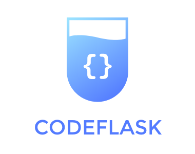
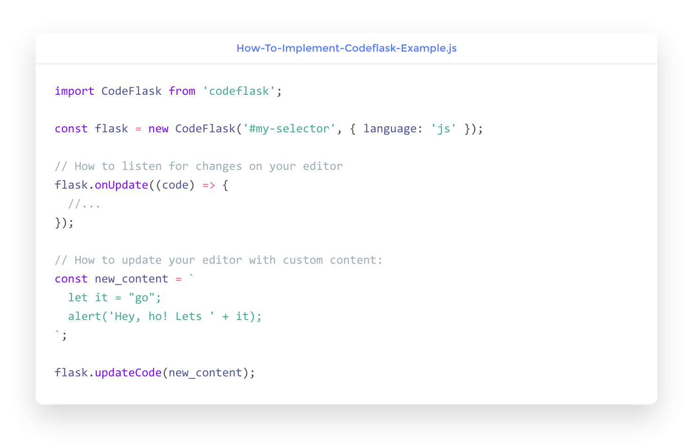

[](https://www.npmjs.com/package/codeflask)
[](https://travis-ci.org/kazzkiq/CodeFlask)

<p align="center">
  <br>
    CodeFlask: A micro code-editor for awesome web pages.
</p>

<p align="center">
  
</p>

## Installation

You can install CodeFlask via npm:

```
npm install codeflask
```

Or use it directly in browser via cdn service:

```
https://unpkg.com/codeflask/build/codeflask.min.js
```

## Usage

```js
import CodeFlask from 'codeflask';

const flask = new CodeFlask('#my-selector', { language: 'js' });
```

### Listening for changes in editor

```js
flask.onUpdate((code) => {
  // do something with code here.
  // this will trigger whenever the code
  // in the editor changes.
});
```

### Updating the editor programatically

```js
// This will also trigger .onUpdate()
flask.updateCode('const my_new_code_here = "Blabla"');
```

### Getting the current code from editor

```js
const code = flask.getCode();
```

### Enabling line numbers

```js
import CodeFlask from 'codeflask';

const flask = new CodeFlask('#my-selector', {
  language: 'js',
  lineNumbers: true
});
```

### Enabling rtl (right to left writing)

```js
import CodeFlask from 'codeflask';

const flask = new CodeFlask('#my-selector', {
  language: 'js',
  rtl: true
});
```

### Enabling read only mode

```js
import CodeFlask from 'codeflask';

const flask = new CodeFlask('#my-selector', {
  language: 'js',
  readonly: true
});
```

### Adding other languages support:

```js
flask.addLanguage('ruby', options)
```

This API is simply a proxy to add a new language to [Prism](http://prismjs.com/) itself (the code highlighter). The `options` parameter must be the same accepted in Prism. You can read more about it [here](http://prismjs.com/extending.html#language-definitions).

By default, CodeFlask supports the following languages (which are also the default supported in Prism):

- Markup (HTML/XML);
- CSS;
- C-like;
- JavaScript;

### Adding your own theme to CodeFlask

By default, CodeFlask comes with a simple theme made from scratch called **[CodeNoon](https://github.com/kazzkiq/CodeFlask.js/blob/master/src/styles/theme-default.js)**.

You can easily override this theme with your own by writting your own CSS and adding it to your project. If that's the case, you should also disable **CodeNoon** with the `defaultTheme` option:

```js
import CodeFlask from 'codeflask';

const flask = new CodeFlask('#my-selector', {
  language: 'js',
  defaultTheme: false
});
```

# Credits & Thanks

CodeFlask.js was made possible by awesome open-source projects such as [Prism.js](https://github.com/PrismJS/prism) and [Rollup](https://github.com/rollup/rollup).
