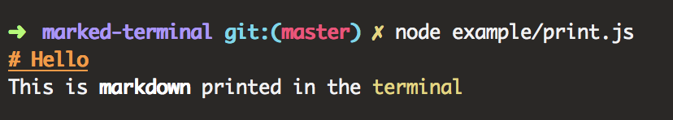

marked-terminal
===

Early release of a custom Renderer for [marked](https://github.com/chjj/marked)
allowing for printing Markdown to the Terminal.

Could for instance be used to print usage information.

## Install

```
npm install marked marked-terminal
```

## Example

```javascript
var marked = require('marked');
var TerminalRenderer = require('../');

marked.setOptions({
  // Define custom renderer
  renderer: new TerminalRenderer()
});

// Show the parsed data
console.log(marked('# Hello \n This is **markdown** printed in the `terminal`'));
```

This will produce the following:




See [more examples](./example/)